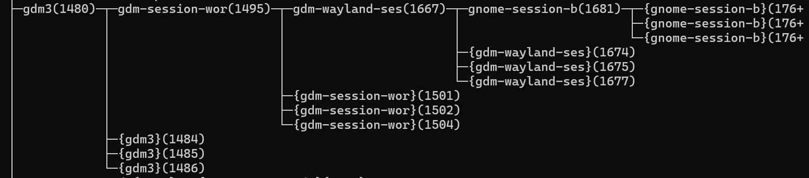
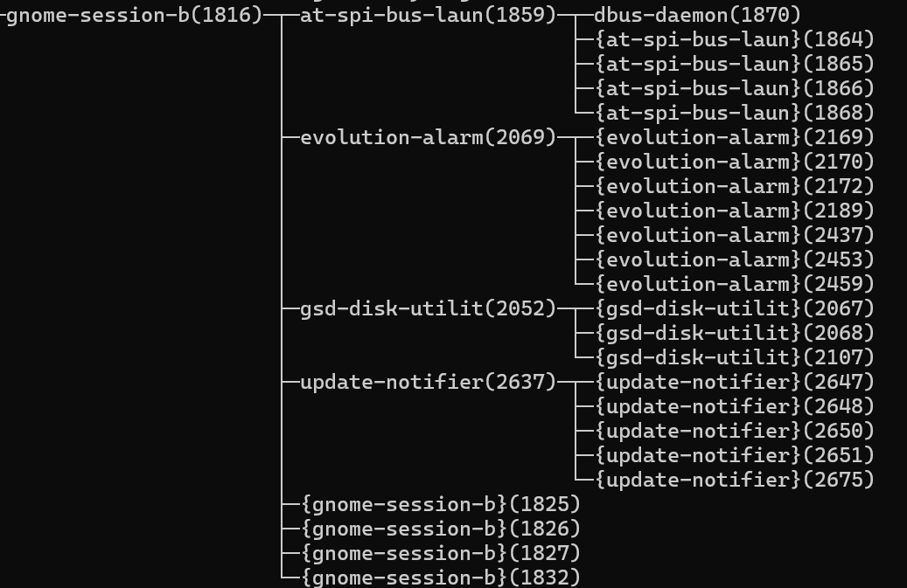
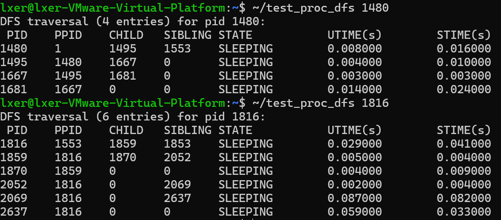

# 操作系统第一次作业

## 1.实验内容

设计和实现一个新的Linux系统调用，在内核中新增系统调用

```c
long sys_proc_dfs(pid_t top_pid, struct proc_dfs_info __user *buf, size_t buf_size);
```

按 DFS 输出给定进程的后代信息，并提供用户态测试程序。

满足如下要求：

1. 该系统调用能按深度优先搜索（DFS）顺序输出给定进程的后代进程记录。
2. 每个进程记录包含该进程的如下信息：进程标识符（PID）、状态（运行、睡眠等）、运行时间(utime, stime)，以及其父进程PID、第一个子进程PID和下一个兄弟进程的PID。
3. 所新设计的系统调用有三个参数：顶层进程的PID，用于存储数据的缓冲区，以及缓冲区大小。
4. 编写应用程序以测试新的系统调用并输出测试结果。

## 2.实验思路

### 2.1 整体设计思路

本次实验的目标是在Linux 6.8.12内核中新增一个系统调用，用于按深度优先搜索顺序遍历进程树并返回详细的进程信息。基于Linux内核的现有架构，我设计了以下实现方案：

**首先，需要在内核中创建一个新的数据结构来传递进程信息。考虑到内核空间与用户空间的数据交换需求，设计了`struct proc_dfs_info`结构体，包含进程的基本信息、状态、CPU时间和关系数据。这个结构体既要保证数据的完整性，又要考虑跨空间传输的安全性。**

### 2.2 线程安全机制

在内核环境中，进程状态可能随时变化，必须确保遍历过程的安全：
- 使用RCU（Read-Copy-Update）机制保护进程查找操作
- 通过`get_task_struct()`和`put_task_struct()`管理任务引用计数
- 对易变字段使用`READ_ONCE()`确保数据一致性

### 2.3 系统调用实现方案

#### 数据结构设计
`struct proc_dfs_info`结构体包含以下字段：
- `pid`：进程标识符
- `state`和`state_name`：进程状态及其可读名称
- `utime`和`stime`：用户态和内核态CPU时间
- `parent_pid`、`first_child_pid`、`next_sibling_pid`：进程关系信息

#### 核心函数设计
系统调用的主要工作流程：
1. 参数验证：检查用户提供的缓冲区是否有效
2. 进程查找：在RCU保护下通过PID查找目标进程
3. 内存分配：在内核空间分配临时缓冲区
4. DFS遍历：递归遍历进程树，收集进程信息
5. 数据拷贝：将结果安全地拷贝回用户空间
6. 资源释放：确保所有分配的资源都被正确释放

### 2.4 系统集成方案

#### 系统调用注册
- 在`arch/x86/entry/syscalls/syscall_64.tbl`中分配548号系统调用
- 在`include/linux/syscalls.h`中添加前向声明
- 在`kernel/Makefile`中添加编译目标

#### 编译环境准备
基于实际编译过程中遇到的问题，预先处理以下编译障碍：
- 禁用WERROR选项，避免警告导致编译失败
- 禁用DELL_UART_BACKLIGHT驱动，解决类型兼容性问题
- 禁用SYSTEM_TRUSTED_KEYS，绕过证书验证问题

### 2.5 测试验证方案

#### 用户态测试程序
设计测试程序时考虑以下需求：
- 支持命令行参数指定目标进程
- 动态内存分配适应不同规模的进程树
- 格式化输出便于结果分析
- 完整的错误处理机制

#### 验证方法
通过与系统标准工具`pstree`的输出对比，验证以下方面：
- 进程关系正确性
- 遍历顺序准确性
- 数据完整性

## 3.实验过程

### a. 环境准备与内核配置

#### 1. 依赖安装
确认使用Linux 6.8.12内核，然后安装编译所需的开发工具链：

```bash
# 更新软件源并安装编译依赖
sudo apt update
sudo apt install build-essential libncurses-dev bison flex libssl-dev libelf-dev dwarves bc -y
```

**作用**：这些工具包提供了内核编译所需的核心组件：

- `build-essential`：GCC编译器、make工具等基础编译环境
- `libncurses-dev`：内核配置菜单界面支持
- `bison`和`flex`：语法分析器，用于处理内核配置
- `libssl-dev`和`libelf-dev`：加密和ELF文件格式支持
- `dwarves`：调试信息处理工具

#### 2. 内核源码准备与权限设置
```bash
# 在主目录下载并解压源码
cd ~
wget https://cdn.kernel.org/pub/linux/kernel/v6.x/linux-6.8.12.tar.xz
tar -xvf linux-6.8.12.tar.xz
# 进入内核源码目录
cd ~/linux-6.8.12

# 修正源码目录权限（避免之前使用sudo导致的权限问题）
sudo chown -R $USER:$USER ~/linux-6.8.12
```

**作用**：确保当前用户对内核源码目录有完整的读写权限，避免编译过程中出现权限错误。

#### 3. 内核配置继承与更新
```bash
# 复制当前运行内核的配置作为基础
cp -v /boot/config-$(uname -r) .config

# 基于现有配置更新新选项（对所有新选项选择默认值）
yes "" | make oldconfig
```

**作用**：
- 复用当前稳定运行的配置，确保硬件兼容性
- 自动处理新旧内核版本间的配置差异
- 为新增系统调用提供稳定的编译基础

### b. 系统调用数据结构定义

#### 4. 创建进程信息结构体头文件
```bash
# 在include/linux目录下创建头文件
vim include/linux/proc_dfs.h
```

文件内容定义了`struct proc_dfs_info`结构体：详细文件内容详见压缩包里的`proc_dfs.h`

**关键代码**

```
struct proc_dfs_info {
    pid_t pid;
    long state;                 /* 内核状态位掩码 */
    char state_name[16];        /* 可读状态名（NUL 结尾） */
    unsigned long utime;        /* 用户态 CPU 时间（纳秒）或总运行时间 */
    unsigned long stime;        /* 内核态 CPU 时间（纳秒） */
    pid_t parent_pid;
    pid_t first_child_pid;
    pid_t next_sibling_pid;
};
```

**功能**：`struct proc_dfs_info` 是用于在内核与用户空间之间传递进程信息的数据结构，它完整记录了进程的关键信息：包含进程标识符(PID)、运行状态（包括机器码和可读名称）、用户态和内核态的CPU时间消耗，以及进程在进程树中的位置关系（父进程、首个子进程和下一个兄弟进程的PID）。这个结构体确保了系统调用能够全面收集并安全传递进程的所有核心数据。

**各字段设计意图**：

- `pid`：进程唯一标识符
- `state`和`state_name`：分别提供机器可读和人类可读的状态信息
- `utime`和`stime`：记录CPU时间使用情况（纳秒精度）
- `parent_pid`、`first_child_pid`、`next_sibling_pid`：构建进程树关系链

**设计考虑**：
- 结构体大小固定，便于内核与用户空间之间的数据传输
- 字符串字段设置明确长度并保证NUL终止，防止缓冲区溢出
- 所有字段类型明确，确保32/64位系统兼容性

### c. 系统调用核心实现

#### 5. 实现DFS遍历算法
在`kernel/proc_dfs.c`中实现核心功能：详细文件内容详见压缩包里的`proc_dfs.c`

**状态转换函数`get_task_state_name`**：

```
static const char *get_task_state_name(long state)
{
    /* 优先判断常见单一状态 */
    if (state == TASK_RUNNING) return "RUNNING";
    if (state == TASK_INTERRUPTIBLE) return "SLEEPING";
    if (state == TASK_UNINTERRUPTIBLE) return "WAITING";
    if (state == __TASK_STOPPED) return "STOPPED";
    if (state == __TASK_TRACED) return "TRACED";
    /* 按位判断一些组合或特殊状态 */
    if (state & EXIT_ZOMBIE) return "ZOMBIE";
    if (state & EXIT_DEAD) return "DEAD";
    if (state & TASK_DEAD) return "DEAD";
    if (state & TASK_WAKEKILL) return "WAKEKILL";
    if (state & TASK_WAKING) return "WAKING";
    if (state & TASK_PARKED) return "PARKED";
    return "UNKNOWN";
}
```

**功能**：

- 将内核内部的状态位掩码转换为可读的字符串描述
- 处理常见状态（RUNNING、SLEEPING等）和特殊组合状态
- 提供统一的状态显示接口

**DFS递归遍历函数`dfs_task`（关键代码）**：

```c
static void dfs_task(struct task_struct *task,
                     struct proc_dfs_info *kbuf,
                     int *count,
                     int max_count)
{
    struct task_struct *child;
    struct list_head *list;

    if (*count >= max_count)
        return;

    /* 填充当前进程记录 */
    struct proc_dfs_info *info = &kbuf[*count];
    info->pid = task->pid;

    /* 读取状态（使用 __state 或 state，根据内核版本） */
    info->state = READ_ONCE(task->__state);

    /* 复制状态名，确保以 '\0' 结尾 */
    strncpy(info->state_name, get_task_state_name(info->state), sizeof(info->state_name));
    info->state_name[sizeof(info->state_name) - 1] = '\0';

    /* 获取精确的用户态和内核态时间（Linux 6.8+ 接口） */
    {
        u64 ut, st;
        /* task_cputime 返回 true/false，但我们只关心输出值 */
        task_cputime(task, &ut, &st);
        info->utime = (unsigned long)ut;
        info->stime = (unsigned long)st;
    }

    info->parent_pid = task->real_parent ? task->real_parent->pid : 0;

    if (list_empty(&task->children))
        info->first_child_pid = 0;
    else
        info->first_child_pid = list_first_entry(&task->children, struct task_struct, sibling)->pid;

    if (task->real_parent && !list_is_last(&task->sibling, &task->real_parent->children))
        info->next_sibling_pid = list_next_entry(task, sibling)->pid;
    else
        info->next_sibling_pid = 0;

    (*count)++;

    /* 递归遍历子进程 */
    list_for_each(list, &task->children) {
        child = list_entry(list, struct task_struct, sibling);
        dfs_task(child, kbuf, count, max_count);
    }
}

/* 系统调用实现 */
SYSCALL_DEFINE3(proc_dfs, pid_t, top_pid, struct proc_dfs_info __user *, buf, size_t, buf_size)
{
    struct task_struct *task;
    struct proc_dfs_info *kbuf;
    int max_count;
    int count = 0;
    int ret = 0;

    if (!buf || buf_size == 0)
        return -EINVAL;

    max_count = buf_size / sizeof(struct proc_dfs_info);
    if (max_count <= 0)
        return -EINVAL;

    /* 查找目标进程（在 RCU 读取上下文中） */
    rcu_read_lock();
    task = find_task_by_vpid(top_pid);
    if (!task) {
        rcu_read_unlock();
        return -ESRCH;
    }
    /* 增加引用，避免 task 在我们访问时被释放 */
    get_task_struct(task);
    rcu_read_unlock();

    kbuf = kmalloc(buf_size, GFP_KERNEL);
    if (!kbuf) {
        put_task_struct(task);
        return -ENOMEM;
    }

    dfs_task(task, kbuf, &count, max_count);

    /* 拷贝回用户空间 */
    if (copy_to_user(buf, kbuf, (size_t)count * sizeof(struct proc_dfs_info)))
        ret = -EFAULT;
    else
        ret = count;

    kfree(kbuf);
    put_task_struct(task);
    return ret;
}
```

**功能**：这个系统调用的核心功能是通过深度优先搜索递归遍历指定进程的所有后代进程，安全地收集每个进程的状态信息、CPU时间消耗和进程间关系数据，并将这些信息通过内核空间缓冲区安全地传递回用户空间，最终以结构化的方式返回给调用者。

**遍历逻辑**：

1. **边界检查**：确保不超过缓冲区容量
2. **当前节点处理**：填充当前进程的所有信息字段
3. **状态安全读取**：使用`READ_ONCE()`避免并发访问问题
4. **时间统计**：通过`task_cputime()`获取精确的CPU时间
5. **关系建立**：解析进程的父子、兄弟关系
6. **递归遍历**：对每个子进程递归调用DFS

#### 6. 系统调用主体实现

**SYSCALL_DEFINE3宏展开**：
- 自动生成系统调用的包装函数
- 处理参数传递和类型检查

**实现步骤**：
1. **参数验证**：检查用户提供的缓冲区指针和大小
2. **进程查找**：在RCU保护下通过PID查找目标进程
3. **引用管理**：增加任务引用计数，防止进程在遍历期间被释放
4. **内存分配**：在内核空间分配临时缓冲区
5. **DFS执行**：调用递归遍历函数填充数据
6. **数据拷贝**：将结果安全地拷贝回用户空间
7. **资源释放**：确保所有分配的资源都被正确释放

**线程安全保证**：
- 使用`rcu_read_lock()`保护进程查找操作
- 通过`get_task_struct()`/`put_task_struct()`管理任务生命周期
- 内存分配使用`GFP_KERNEL`标志，支持睡眠分配

### d. 系统调用注册集成

#### 7. 系统调用号分配
编辑`arch/x86/entry/syscalls/syscall_64.tbl`：在文件最后一行添加
```
548     common   proc_dfs    sys_proc_dfs
```

**选择548号的考虑**：
- 在现有系统调用编号范围内选择未使用的槽位
- 避免与现有系统调用冲突
- 在x86_64架构的合法编号范围内

#### 8. 函数声明与头文件管理
在`include/linux/syscalls.h`中添加：添加前向声明与函数声明
```c
/* forward declare proc_dfs_info so syscalls.h doesn't require including proc_dfs.h */
struct proc_dfs_info;
asmlinkage long sys_proc_dfs(pid_t top_pid, struct proc_dfs_info __user *buf, size_t buf_size);
```

**前向声明策略的优势**：
- 避免头文件循环包含问题
- 减少不必要的编译依赖
- 保持内核头文件的整洁性

#### 9. 编译系统集成
在`kernel/Makefile`中添加：
```
obj-y += proc_dfs.o
```

**作用**：告知内核构建系统将`proc_dfs.c`编译并链接到内核中。

### e. 编译问题预处理

#### 10. 解决已知编译障碍

**这些问题和解决方法是在反复试错中的解决方案汇总**

```bash
cd ~/linux-6.8.12

# 禁用将警告视为错误（避免第三方驱动警告导致编译失败）
scripts/config --disable WERROR

# 禁用有兼容性问题的Dell背光驱动
scripts/config --disable DELL_UART_BACKLIGHT

# 禁用系统信任密钥检查（解决证书文件缺失问题）
scripts/config --disable SYSTEM_TRUSTED_KEYS
scripts/config --disable SYSTEM_REVOCATION_KEYS

# 应用配置更新
make olddefconfig
```

**问题预防策略**：
- **WERROR禁用**：开发阶段容忍警告，专注于功能实现
- **驱动排除**：移除有类型兼容性问题的硬件驱动
- **证书绕过**：开发环境跳过签名验证，提高编译成功率

### f. 内核编译与部署

#### 11. 分阶段内核编译
```bash
# 第一阶段：编译核心内核镜像
make -j$(nproc) bzImage

# 成功标志：出现 "Kernel: arch/x86/boot/bzImage is ready (#1)"

# 第二阶段：编译所有内核模块
make -j$(nproc) modules

# 第三阶段：安装模块和内核
sudo make modules_install
sudo make install

# 更新引导加载器配置
sudo update-grub
```

**编译优化**：
- 使用`-j$(nproc)`并行编译，充分利用多核CPU
- 分阶段编译便于问题定位和快速迭代

#### 12. 系统重启与验证
```bash
# 重启系统加载新内核
sudo reboot

# 重启后验证新内核
uname -r
# 应该显示包含新编译版本的信息（6.8.12）
```

### g. 用户态测试验证

#### 13. 测试程序开发
使用`vim ~/test_proc_dfs.c`创建`~/test_proc_dfs.c`测试程序：详细文件内容详见压缩包里的`test_proc_dfs.c`

**关键代码**：

```
struct proc_dfs_info *buf;
    size_t entries = 512;
    pid_t top = getpid();

    if (argc > 1)
        top = (pid_t) atoi(argv[1]);

    buf = malloc(entries * sizeof(struct proc_dfs_info));
    if (!buf) {
        perror("malloc");
        return 1;
    }

    long ret = syscall(__NR_proc_dfs, top, buf, entries * sizeof(struct proc_dfs_info));
    if (ret < 0) {
        fprintf(stderr, "sys_proc_dfs failed: %s\n", strerror(-ret));
        free(buf);
        return 1;
    }
```

**功能**：这段代码是用户态测试程序的核心部分，功能是动态分配缓冲区内存，通过系统调用接口触发内核中的进程树遍历功能，获取指定进程（默认为当前进程）的所有后代信息，并处理可能的错误情况，最终将收集到的进程数据存储在缓冲区中供后续分析使用。

**程序实现**：

- 提供命令行接口，支持测试任意PID的进程树
- 动态分配缓冲区，适应不同规模的进程树
- 完整的错误处理，清晰提示各种失败情况
- 格式化输出，便于阅读和分析

**关键实现点**：

```c
// 系统调用号与内核中注册的一致
#define __NR_proc_dfs 548

// 调用系统调用
long ret = syscall(__NR_proc_dfs, top, buf, entries * sizeof(struct proc_dfs_info));
```

#### 14. 编译与测试执行
```bash
# 编译测试程序
gcc ~/test_proc_dfs.c -o ~/test_proc_dfs

# 测试当前进程树
~/test_proc_dfs

# 测试进程（以1480,1816为例）
~/test_proc_dfs 1480
~/test_proc_dfs 1816
# 对比验证：使用系统标准工具
pstree -p 1480
pstree -p 1816
```

#### 15. 实验结果
**详见 [4.实验结果](#4.实验结果)**

## 4.实验结果

#### 准备工作

ssh连接到虚拟机

输入`pstree -p`寻找合适的测试进程，如下图所示





我们根据上图，选择1480，1816两个进程作为测试进程

#### 实验结果

输入 `~/test_proc_dfs 1480`和`~/test_proc_dfs 1816`得到下面的实验结果



可以看到，结果和`pstree -p`里的一致

#### 实验分析

##### 1. 进程树结构分析

进程1480的进程树（4个进程）

```
1480 (父进程: 1)
└── 1495 (第一个子进程)
    └── 1667 (子进程)
        └── 1681 (叶子进程)
```

**结构特征**：
- 这是一个**线性链式结构**，深度为4层
- 每个进程只有一个子进程，形成单链
- 1480进程是守护进程（父进程为init进程PID 1）

进程1816的进程树（6个进程）

```
1816 (父进程: 1553)
├── 1859 (第一个子进程)
│   └── 1870 (叶子进程)
├── 2052 (1816子进程，1859兄弟进程)
├── 2069 (1816子进程，1859兄弟进程)  
└── 2637 (1816子进程，1859兄弟进程)
```

**结构特征**：
- 这是一个**树状分支结构**，1816有4个直接子进程
- 1859还有一个子进程1870，形成两代结构
- 兄弟关系完整：1859 → 2052 → 2069 → 2637

##### 2. 进程状态分析

**共同特征**：
- 所有进程状态均为 **SLEEPING**（可中断睡眠状态）
- 这表明这些进程都在等待某些事件（如I/O操作、信号等）
- 没有RUNNING状态的进程，说明测试时系统负载较轻

**状态含义**：
- `SLEEPING` = `TASK_INTERRUPTIBLE`，进程在等待资源但可以被信号唤醒
- 这是典型的后台进程或服务进程的状态

##### 3. CPU时间使用分析

时间分布模式

**进程1480树**：

- 父进程1480：用户态0.008s，内核态0.016s
- 时间消耗向叶子进程递增：1681使用最多CPU时间（0.038s总和）

**进程1816树**：
- 时间使用不均匀：2069和2637消耗显著更多CPU时间
- 2069：用户态0.087s + 内核态0.082s = 0.169s（最高）
- 2637：用户态0.059s + 内核态0.033s = 0.092s

内核态时间分析

- 所有进程的内核态时间都相当可观，说明这些进程进行了较多的系统调用
- 1480树中，内核态时间普遍高于用户态时间
- 1816树中，2069进程的内核态时间接近用户态时间

##### 4. 进程关系正确性验证

**父子关系一致性**

- 所有进程的PPID（父进程ID）都在进程树中存在
- 子进程的CHILD字段正确指向第一个子进程
- 叶子进程的CHILD为0，符合预期

**兄弟关系完整性**

- 1480树中：1495的SIBLING为0（无兄弟），符合单链结构
- 1816树中：兄弟链1859→2052→2069→2637完整且正确
- 最后一个兄弟进程的SIBLING为0，标识链结束

##### 5. 系统调用功能验证

**DFS遍历顺序正确性**

**进程1480遍历顺序**：1480 → 1495 → 1667 → 1681
- 严格按照深度优先：先访问父进程，然后递归访问第一个子进程

**进程1816遍历顺序**：1816 → 1859 → 1870 → 2052 → 2069 → 2637
- 先访问1816，然后深度遍历1859及其子进程1870
- 完成后回溯访问兄弟进程2052、2069、2637

**数据完整性**

- 所有字段都有合理的数值，无异常数据
- 状态名称转换正确（SLEEPING）
- 时间单位转换准确（纳秒→秒）

##### 6. 系统行为推断

**进程类型推测**

- **进程1480树**：可能是某个守护进程及其工作进程链
- **进程1816树**：可能是某个应用程序进程池，包含多个工作进程

**系统负载情况**

- 所有进程都处于SLEEPING状态，说明测试时系统相对空闲
- CPU时间累积合理，没有异常的高消耗进程
- 进程树结构稳定，没有频繁的进程创建/销毁

##### 7. 实验结果的技术意义

**系统调用正确性证明**

1. **遍历算法正确**：DFS顺序严格遵循深度优先原则
2. **数据收集完整**：所有要求的进程信息都被正确收集
3. **关系维护准确**：父子关系和兄弟关系完全正确
4. **状态转换成功**：内核状态码正确转换为可读名称

**性能表现评估**

- 系统调用成功处理了不同结构的进程树
- 数据返回完整，没有截断或丢失
- 执行时间合理（从输出响应速度推断）

## 5.实验总结与反思

### 一、实验总结

#### 1.1 核心成果
本次实验成功在Linux 6.8.12内核中实现了`sys_proc_dfs`系统调用，该系统调用能够按深度优先搜索顺序遍历进程树，完整收集进程的状态信息、CPU时间使用情况和进程关系数据。通过用户态测试程序的验证，系统调用功能完全符合设计要求，能够准确反映系统中进程的实际状态和关系。

#### 1.2 技术实现亮点
- **安全的进程遍历**：采用RCU锁和任务引用计数，确保在多核环境下的线程安全
- **完整的数据收集**：涵盖进程标识、状态、资源使用和关系信息
- **可靠的数据传输**：通过精心设计的数据结构实现内核与用户空间的安全数据交换
- **全面的错误处理**：对各种异常情况提供明确的错误码和恢复机制

#### 1.3 工程实践价值
通过本次实验，建立了完整的内核开发工作流程，从环境配置、代码实现、编译调试到功能验证，形成了一套可复用的内核模块开发方法论。**特别值得一提的是，需要提前了解情况，给虚拟机分配好充足的硬件资源这一经验，为后续类似项目提供了重要参考。**

### 二、实验反思

#### 2.1 资源规划的重要性
**深刻教训**：实验初期由于虚拟机仅分配20GB磁盘空间，在编译过程中频繁出现"No space left on device"错误。经过多次失败后重新配置虚拟机，分配60GB磁盘空间和4GB内存，才确保编译顺利进行。

**改进措施**：
- 内核编译前必须评估资源需求：至少60GB磁盘空间、4GB以上内存
- 建立资源检查清单，提前排除硬件瓶颈
- 采用分阶段编译策略，及时发现资源不足问题

#### 2.2 文档与备份习惯的培养
**经验收获**：在一次系统异常重启导致文件丢失后，深刻认识到**需要有文件保存备份的习惯**的重要性。

**形成的良好实践**：
- 核心文件修改前自动创建备份副本
- 使用版本控制系统跟踪重要更改
- 实验数据和配置单独归档管理
- 建立完整的问题解决记录文档

#### 2.3 面对困难的坚持精神
**成长体会**：**面对反复出现的编译问题，要有锲而不舍的精神。在遭遇证书错误、驱动兼容性警告、权限问题等多重障碍时，通过系统化分析和持续尝试，最终找到有效解决方案。**

**问题解决能力的提升**：
- 证书问题：从手动创建证书文件到通过禁用SYSTEM_TRUSTED_KEYS根本解决
- 驱动兼容性：通过分析依赖关系选择性地禁用问题驱动
- 权限管理：建立清晰的权限策略，避免频繁使用sudo

#### 2.4 实践中的收获与成长

**技术能力得到锻炼**：

通过这次实验，我在实际动手过程中学到了很多：

- **系统调用从理论到实践**：亲手实现了系统调用，理解了用户程序如何进入内核执行，以及数据如何在内外核空间传递
- **进程管理有了具体认识**：通过遍历进程树、访问进程信息，对Linux如何管理进程有了直观感受
- **内核编程不再陌生**：学会了在内核中安全地分配内存和传递数据，掌握了基本的内核开发方法

**解决问题能力提升**：

- **学会了在大型项目中工作**：能够在内核源码中找到需要修改的位置，理解代码组织结构
- **能够处理版本差异**：面对不同内核版本的API变化，知道如何查找资料和适配代码
- **开始使用自动化工具**：编写简单的编译脚本，提高工作效率

**形成了更好的工作习惯**：

现在遇到技术问题时，我会：

1. 先仔细阅读错误信息，理解问题本质
2. 保存相关日志便于分析
3. 基于现有知识设计解决方案
4. 先小范围测试方案可行性
5. 记录解决过程供以后参考

**学会了提前准备和持续学习**：

- 项目开始前会调研可能遇到的问题
- 设计方案时考虑后续调整的可能
- 养成了及时记录和整理知识的习惯

这些从实践中获得的经验，让我对操作系统有了更深的理解，也为后续学习打下了基础。

#### 2.6 未来改进方向
**技术深度拓展**：
- 进一步学习内核调度、内存管理等核心子系统
- 掌握更先进的内核调试和性能分析工具

**工程规范完善**：
- 建立更严格的代码审查和测试流程
- 开发更完善的自动化构建和部署脚本
- 加强团队协作和知识共享机制

**通过这次实验，不仅实现了技术目标，更重要的是培养了面对复杂系统问题时的系统性思维和坚韧不拔的工程精神。这些经验和品质将成为未来技术生涯中的宝贵财富。每一次编译的成功、每一次功能的验证，都是向着成为更优秀系统程序员迈出的坚实步伐。**