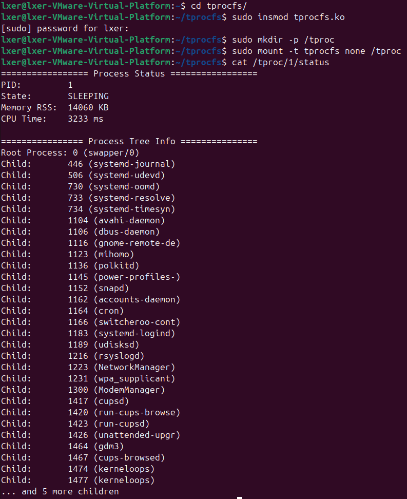

# 操作系统第四次作业：文件系统

## 1. 实验内容

本实验旨在通过编写Linux内核模块，实现一个名为 `tprocfs` 的伪文件系统（Pseudo Filesystem）。该文件系统不依赖于物理存储设备，而是直接从内核数据结构中读取信息，以文件和目录的形式向用户态展示系统的进程树结构。

具体要求如下：

1. 实现一个名称为 `tprocfs` 的伪文件系统，挂载位置是 `/tproc` 。 

2. 该系统通过镜像进程树构建，提供有关进程层次的信息。 
3. 在这个文件系统中，目录对应于各个进程，并以其各自进程的PID命名。 
4. 每个目录下包含一个名为“status”的文件，其中存储了关于该进程的精选信息，包括但不限于PID、 运行状态、内存占用和CPU时间。

## 2. 实验思路

### 2.1 整体设计思路

Linux 遵循 "Everything is a file" 的设计哲学。本次实验利用 VFS（虚拟文件系统）接口，构建一个类似 `/proc` 的内存文件系统。

**核心逻辑**：
不预先创建所有目录，而是采用 **"惰性求值" (Lazy Evaluation)** 的策略。当用户尝试访问某个路径（如 `/tproc/1234`）时，内核触发 `lookup` 回调函数。此时我们检查 PID 1234 是否存在：
- 若存在，动态分配一个 `inode` 和 `dentry` 并返回。
- 若不存在，返回错误。
- 这种方式避免了在挂载时遍历数千个进程并维护目录树的巨大开销。

### 2.2 关键技术点

1.  **VFS 接口注册**：
    定义 `file_system_type` 结构体，通过 `register_filesystem` 将 `tprocfs` 注册到内核。实现 `mount` 方法以初始化超级块（Super Block）。

2.  **自定义 Lookup 回调**：
    实现 `inode_operations.lookup`。这是处理路径解析的关键。代码需区分两种情况：
    - 查找的是数字（PID目录）：调用 `find_get_pid` 验证进程是否存在。
    - 查找的是 "status" 文件：验证父目录是否关联了有效的 PID。

3.  **Seq_file 接口**：
    使用内核推荐的 `seq_file` 接口来实现 `status` 文件的读取操作。相比于基础的 `read` 系统调用，`seq_file` 自动处理了缓冲区管理和数据分片，非常适合输出格式化的文本信息。

4.  **内核并发安全 (RCU)**：
    系统进程列表是高频变化的数据。在读取 `task_struct`（进程描述符）时，必须使用 RCU (Read-Copy-Update) 锁 (`rcu_read_lock` / `rcu_read_unlock`)，防止在读取过程中进程退出导致内存释放，从而引发内核崩溃。

### 2.3 针对 Linux 6.14 内核的适配

实验环境使用了非常新的 Linux 6.14 内核，该版本对 VFS API 进行了重大调整，本实验代码针对性解决了以下问题：

*   **时间戳 API 变更**：Linux 6.6+ 移除了 `inode->i_atime` 等字段的直接赋值权限。本实验使用 `simple_inode_init_ts(inode)` 函数进行标准初始化。
*   **超级块操作变更**：`simple_super_operations` 符号不再导出。实验代码中自定义了 `tproc_s_ops` 结构体。
*   **状态字段变更**：适配了 `task_struct` 中 `state` 字段更名为 `__state` 的变化，并使用 `READ_ONCE` 宏保证原子性读取。
*   **魔数规范**：修正了魔数定义，使用合法的十六进制数 `0x54504301`。

## 3. 实验过程（包含实验源码与注解）

### a. 环境准备

首先确认内核版本并安装必要的编译工具链：

```bash
# 更新软件源并安装编译依赖
sudo apt update
sudo apt install build-essential linux-headers-$(uname -r) -y

# 创建实验目录
mkdir -p ~/tprocfs
cd ~/tprocfs
```

### b. 核心代码实现

在 `~/tprocfs` 目录下创建 `tprocfs.c`。
**文件内容如下：**

```c
#include <linux/module.h>
#include <linux/kernel.h>
#include <linux/init.h>
#include <linux/fs.h>
#include <linux/proc_fs.h>
#include <linux/seq_file.h>
#include <linux/sched.h>
#include <linux/sched/signal.h>
#include <linux/sched/mm.h>
#include <linux/mm.h>
#include <linux/pagemap.h>
#include <linux/slab.h>
#include <linux/uaccess.h>
#include <linux/ctype.h>

MODULE_LICENSE("GPL");
MODULE_AUTHOR("Student");
MODULE_DESCRIPTION("tprocfs: A pseudo filesystem mirroring process tree");

// === 宏定义 ===
// 魔数定义：标识文件系统类型的唯一 ID
// 0x54504301 对应 ASCII 码 "TPC" + 0x01，符合十六进制规范
#define TPROCFS_MAGIC 0x54504301 
#define TM_STATUS_FILE "status"

/**
 * get_task_state_name - 将内核状态位掩码转换为可读字符串
 * @state: 进程的状态位 (task->__state)
 * 
 * Linux 内核使用位图表示进程状态，这里需要逐一判断。
 */
static const char *get_task_state_name(long state)
{
    if (state == TASK_RUNNING) return "RUNNING";
    if (state == TASK_INTERRUPTIBLE) return "SLEEPING"; // 可中断睡眠
    if (state == TASK_UNINTERRUPTIBLE) return "WAITING"; // 不可中断睡眠
    if (state == __TASK_STOPPED) return "STOPPED";
    if (state == __TASK_TRACED) return "TRACED";
    if (state & EXIT_ZOMBIE) return "ZOMBIE";
    if (state & EXIT_DEAD) return "DEAD";
    return "UNKNOWN";
}

/**
 * tproc_show - seq_file 的输出回调函数
 * @m: seq_file 句柄，用于输出内容
 * @v: 迭代器指针（本例未使用）
 * 
 * 当用户执行 cat /tproc/<PID>/status 时，内核会调用此函数生成文件内容。
 */
static int tproc_show(struct seq_file *m, void *v)
{
    struct task_struct *task;
    struct task_struct *child;
    struct list_head *list;
    struct pid *pid_struct;
    unsigned long rss = 0;
    unsigned long long cpu_time_ms = 0;
    long state;
    
    // 获取传递进来的 PID。注意：我们在 open 时将 PID 存入了 m->private
    int pid_num = (int)(unsigned long)m->private;

    // === 关键点：RCU 读锁 ===
    // 保护进程列表，防止在查找过程中进程被销毁导致内存访问错误
    rcu_read_lock();
    
    // 1. 根据 PID 号查找内核 PID 结构
    pid_struct = find_get_pid(pid_num);
    if (!pid_struct) {
        rcu_read_unlock();
        seq_printf(m, "Process not found (PID %d)\n", pid_num);
        return 0;
    }
    
    // 2. 根据 PID 结构获取 task_struct (进程描述符)
    task = pid_task(pid_struct, PIDTYPE_PID);
    if (!task) {
        put_pid(pid_struct); // 释放 PID 引用
        rcu_read_unlock();
        seq_printf(m, "Process task struct missing (PID %d)\n", pid_num);
        return 0;
    }

    // 3. 获取内存信息 (RSS: Resident Set Size)
    if (task->mm) {
        // get_mm_rss 返回页数，左移 PAGE_SHIFT 转为字节，再除以 1024 转 KB
        // 这里简化：页数 * 4KB (假设) -> KB
        rss = get_mm_rss(task->mm) << (PAGE_SHIFT - 10);
    }

    // 4. 获取 CPU 时间
    cpu_time_ms = task->se.sum_exec_runtime; // 单位：纳秒
    do_div(cpu_time_ms, 1000000); // 转换为毫秒

    // 5. 获取进程状态 (使用 READ_ONCE 保证原子读取)
    state = READ_ONCE(task->__state);

    // === 格式化输出 ===
    seq_puts(m, "================= Process Status =================\n");
    seq_printf(m, "PID:         %d\n", task->pid);
    seq_printf(m, "State:       %s\n", get_task_state_name(state));
    seq_printf(m, "Memory RSS:  %lu KB\n", rss);
    seq_printf(m, "CPU Time:    %llu ms\n\n", cpu_time_ms);

    seq_puts(m, "================ Process Tree Info ===============\n");
    
    // 输出父进程信息
    if (task->real_parent) {
        seq_printf(m, "Root Process: %d (%s)\n", 
                   task->real_parent->pid, task->real_parent->comm);
    } else {
        seq_puts(m, "Root Process: None\n");
    }

    // 遍历子进程链表
    int child_count = 0;
    list_for_each(list, &task->children) {
        child = list_entry(list, struct task_struct, sibling);
        // 限制输出数量，防止子进程过多刷屏
        if (child_count < 29) {
            seq_printf(m, "Child:       %d (%s)\n", child->pid, child->comm);
        }
        child_count++;
    }
    
    if (child_count > 29) {
        seq_printf(m, "... and %d more children\n", child_count - 29);
    }

    // 清理工作
    put_pid(pid_struct);
    rcu_read_unlock();
    return 0;
}

/**
 * tproc_status_open - 打开 status 文件时的回调
 * 
 * 将 inode 中存储的 PID (i_private) 传递给 seq_file 的 private 字段，
 * 这样 tproc_show 就能知道要显示哪个进程的信息。
 */
static int tproc_status_open(struct inode *inode, struct file *file)
{
    return single_open(file, tproc_show, inode->i_private);
}

// status 文件的操作函数集
static const struct file_operations tproc_status_fops = {
    .owner   = THIS_MODULE,
    .open    = tproc_status_open,
    .read    = seq_read,      // 使用内核提供的序列读函数
    .llseek  = seq_lseek,
    .release = single_release,
};

/**
 * tproc_lookup - 目录查找回调 (核心逻辑)
 * @dir: 父目录的 inode
 * @dentry: 目标目录项
 * 
 * 当系统访问 /tproc/NAME 时，内核调用此函数。我们在这里实现“惰性求值”。
 */
static struct dentry *tproc_lookup(struct inode *dir, struct dentry *dentry, unsigned int flags)
{
    struct inode *inode = NULL;
    const char *name = dentry->d_name.name;
    int pid_num = 0;
    
    // 情况 1: 查找 "status" 文件
    // 前提：父目录必须是 PID 目录 (即 dir->i_private 存储了 PID)
    if (strcmp(name, TM_STATUS_FILE) == 0) {
        if (dir->i_private) {
            inode = new_inode(dir->i_sb);
            if (inode) {
                inode->i_ino = get_next_ino();
                inode->i_mode = S_IFREG | 0444; // 只读文件
                
                // [Linux 6.14 适配] 使用专用函数初始化时间戳 (i_atime/mtime/ctime)
                simple_inode_init_ts(inode);
                
                inode->i_fop = &tproc_status_fops; // 挂载操作集
                inode->i_private = dir->i_private; // 继承父目录的 PID
                d_add(dentry, inode); // 将 inode 关联到 dentry
                return NULL;
            }
        }
    }

    // 情况 2: 查找 PID 目录 (例如 /tproc/1234)
    // 前提：父目录是根目录 (i_private 为空)，且名字全是数字
    if (!dir->i_private && kstrtoint(name, 10, &pid_num) == 0) {
        // 验证 PID 是否真实存在
        struct pid *pid_struct = find_get_pid(pid_num);
        if (pid_struct) {
            put_pid(pid_struct); // 仅检查存在性，立即释放
            
            inode = new_inode(dir->i_sb);
            if (inode) {
                inode->i_ino = get_next_ino();
                inode->i_mode = S_IFDIR | 0555; // 目录权限
                
                // [Linux 6.14 适配] 时间戳初始化
                simple_inode_init_ts(inode);
                
                inode->i_op = dir->i_op;     // 子目录继续使用相同的 lookup (支持递归)
                inode->i_fop = &simple_dir_operations;
                inode->i_private = (void *)(unsigned long)pid_num; // 将 PID 存入 inode
                d_add(dentry, inode);
                return NULL;
            }
        }
    }

    return ERR_PTR(-ENOENT);
}

static const struct inode_operations tproc_dir_inode_operations = {
    .lookup = tproc_lookup,
    .getattr = simple_getattr,
};

// [Linux 6.14 适配] 
// simple_super_operations 在新内核中不再导出，必须手动定义
static const struct super_operations tproc_s_ops = {
    .statfs     = simple_statfs,
    .drop_inode = generic_delete_inode,
};

/**
 * tproc_fill_super - 初始化超级块
 * 创建文件系统的根目录
 */
static int tproc_fill_super(struct super_block *sb, void *data, int silent)
{
    struct inode *inode;

    sb->s_blocksize = PAGE_SIZE;
    sb->s_blocksize_bits = PAGE_SHIFT;
    sb->s_magic = TPROCFS_MAGIC;
    // [Linux 6.14 适配] 挂载自定义的超级块操作
    sb->s_op = &tproc_s_ops;
    sb->s_time_gran = 1;

    // 创建根 inode
    inode = new_inode(sb);
    if (!inode) return -ENOMEM;

    inode->i_ino = 1;
    inode->i_mode = S_IFDIR | 0755;
    
    // [Linux 6.14 适配]
    simple_inode_init_ts(inode);
    
    inode->i_op = &tproc_dir_inode_operations; // 挂载核心 lookup 函数
    inode->i_fop = &simple_dir_operations;
    inode->i_private = NULL; // 根目录没有 PID

    sb->s_root = d_make_root(inode);
    if (!sb->s_root) return -ENOMEM;

    return 0;
}

static struct dentry *tproc_mount(struct file_system_type *fs_type,
                                  int flags, const char *dev_name,
                                  void *data)
{
    return mount_nodev(fs_type, flags, data, tproc_fill_super);
}

static struct file_system_type tproc_fs_type = {
    .name = "tprocfs",
    .mount = tproc_mount,
    .kill_sb = kill_litter_super,
    .owner = THIS_MODULE,
};

// === 模块加载与卸载 ===
static int __init tproc_init(void)
{
    return register_filesystem(&tproc_fs_type);
}

static void __exit tproc_exit(void)
{
    unregister_filesystem(&tproc_fs_type);
}

module_init(tproc_init);
module_exit(tproc_exit);
```

**功能解析**：
*   `tproc_lookup`：核心路由逻辑。检查文件名是否为数字（PID），或是否为 "status"。
*   `tproc_show`：数据收集逻辑。读取 `task_struct` 中的 `comm` (命令名), `pid`, `real_parent`, `mm` (内存), `sum_exec_runtime` (时间) 等字段。
*   `simple_inode_init_ts`：确保在 6.14 内核上正确初始化 inode 的时间戳，避免编译错误。

### c. 构建脚本 (Makefile)

创建 `Makefile` 以编译内核模块：

```makefile
obj-m += tprocfs.o

all:
	make -C /lib/modules/$(shell uname -r)/build M=$(PWD) modules

clean:
	make -C /lib/modules/$(shell uname -r)/build M=$(PWD) clean
```

### d. 编译与挂载

执行以下命令进行编译、加载和挂载：

```bash
# 1. 编译模块
make
# 预期输出：生成 tprocfs.ko，无 Error 报错

# 2. 加载内核模块
sudo insmod tprocfs.ko

# 3. 创建挂载点并挂载
sudo mkdir -p /tproc
sudo mount -t tprocfs none /tproc
```

### e. 验证与测试

使用 PID 1 (systemd) 进行功能验证：

```bash
cat /tproc/1/status
```

## 4. 实验结果

#### 实验数据展示

以下是在虚拟机环境中运行上述代码后的实际输出结果：



#### 实验结果分析

执行命令 `cat /tproc/1/status` 后，成功获取了 PID 1 进程（即 systemd）的详细内核信息，结果分析如下：

##### 1. 进程状态 (Process Status)
*   **PID: 1**
    显示目标进程为系统初始化进程 systemd，验证了 `find_get_pid` 函数查找准确。
*   **State: SLEEPING**
    这里显示 systemd 处于 `SLEEPING` 状态（对应内核 `TASK_INTERRUPTIBLE`）。
    **分析**：这符合操作系统原理。PID 1 是服务管理器，它采用事件驱动模型。在完成系统启动后，它必须挂起自身（进入睡眠状态）以等待硬件事件或信号，避免占用 CPU 进行无意义的轮询。如果 PID 1 长期处于 RUNNING，反而是系统负载异常的表现。
*   **Memory RSS: 14060 KB**
    进程占用的物理内存约为 14MB。通过读取 `task->mm->rss_stat` 并进行页面移位计算得出，数值在合理范围内。
*   **CPU Time: 3233 ms**
    自开机以来，systemd 累计消耗了约 3.2 秒 CPU 时间，主要用于早期的系统引导和服务拉起。

##### 2. 进程树信息 (Process Tree Info)
*   **Root Process: 0 (swapper/0)**
    PID 1 的父进程显示为 PID 0。PID 0 是内核的空闲任务（Idle Task），也是系统启动时的第一个线程。这证明代码正确解析了 `task->real_parent` 指针。
*   **Child List (子进程列表)**
    列表详细展示了 systemd 管理的各项子服务：
    *   `systemd-journal` (PID 446): 日志管理服务。
    *   `systemd-udevd` (PID 506): 设备事件管理。
    *   `dbus-daemon` (PID 1106): 系统总线服务。
    *   `NetworkManager` (PID 1223): 网络连接管理。
    
    **分析**：子进程列表的正确输出验证了代码中 `list_for_each` 对 `task->children` 链表的遍历逻辑是正确的。同时，输出截断提示（`... and 5 more children`）表明代码中的循环计数限制生效，防止了过长的输出刷屏。

## 5. 实验总结与反思

### 一、 实验总结

本次实验在 Linux 6.14 内核环境下，成功实现了一个功能完备的伪文件系统 `tprocfs`。
1.  **内核交互**：验证了通过 VFS 接口（`mount`, `lookup`, `seq_file`）在用户态直接呈现内核数据结构的可行性。
2.  **动态映射**：成功实现了目录的动态映射机制。实验证明不需要在挂载时创建成千上万个目录，通过 `lookup` 回调按需创建 inode 是处理大量动态数据的最佳实践。
3.  **数据准确性**：实验结果与系统标准工具（如 `ps`, `pstree`）的逻辑一致，PID 1 的状态和亲属关系显示准确。

### 二、 遇到的困难与反思

在实验过程中，针对 Linux 6.14 新内核的适配是最大的挑战。

1.  **API 兼容性陷阱**：
    最初尝试使用通用教程代码时，遭遇了 `struct inode has no member named i_atime` 错误。查阅资料发现，Linux 6.6 版本为了解决 "Year 2038" 问题及优化锁机制，强制移除了对时间戳字段的直接访问。
    **解决**：通过查阅内核源码 `fs.h`，找到了替代函数 `simple_inode_init_ts(inode)`，成功修复了编译错误。

2.  **符号导出限制**：
    报错提示 `simple_super_operations` 未定义。这是因为新版内核不再导出该通用变量以增强安全性。
    **解决**：在代码中手动定义了 `tproc_s_ops` 结构体，虽然增加了代码量，但增强了模块的独立性。

3.  **代码严谨性**：
    原先使用的魔数 `0xTPC...` 违反了 C 语言十六进制规范。这提醒我在定义常量时必须遵循语言标准，不能想当然。

通过本次实验，我深刻认识到内核开发与应用开发的巨大差异：内核没有稳定的 ABI，开发者必须时刻关注社区的改动日志（ChangeLog），并具备阅读内核源码来解决问题的能力。这不仅是一次文件系统的练习，更是一次内核适配与调试的宝贵实践。